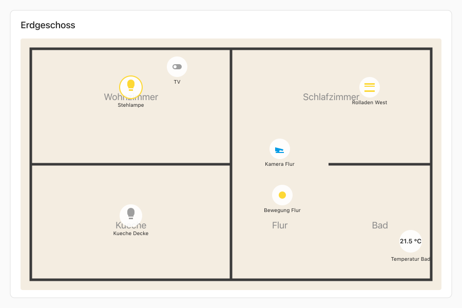

# MyHouse Floorplan

Eine Home-Assistant-Lovelace-Karte, mit der du ein Bild einer Etage hochlaedst und darauf einzelne Geraete platzierst. Die Karte zeigt den Status jedes Geraets visuell an und erlaubt das Schalten per Klick.



## Funktionen

- Bild-Upload direkt aus dem Lovelace-Editor (kein Zugriff auf das Dateisystem noetig)
- Drag-and-Drop zum Platzieren der Geraete auf dem Bild
- Statusanzeige fuer `light`, `switch`, `binary_sensor`, `sensor`, `cover`, `camera`
- Klick auf einen Marker schaltet das Geraet (oder oeffnet die more-info-Ansicht)
- **Kameras:** `mdi:cctv`-Icon am Marker; Klick oeffnet den Live-Stream als Popup. Genutzt wird HAs eigenes `<ha-camera-stream>` element — das waehlt automatisch zwischen HLS/WebRTC/mjpeg/Snapshot je nach Kamera, sodass auch Kameras ohne mjpeg-stream funktionieren.
- **Temperatur-Sensoren** (`device_class: temperature`): zeigen nur den Wert, kein Icon (Wert + Einheit ist aussagekraeftig genug)
- **Cover/Rollladen:** State-abhaengiges Icon (`mdi:window-shutter-open` bei offen, `mdi:window-shutter` bei geschlossen). Das Icon einiger Integrationen (z.B. Homematic) wird bewusst uebersteuert, weil es statisch ist.
- Responsive: Marker-Positionen sind in % gespeichert

## Installation

### Via HACS (Custom Repository)

1. In Home Assistant **HACS** oeffnen → Reiter **Frontend**
2. Oben rechts **drei Punkte** → **Custom repositories**
3. Eintragen:
   - **Repository:** `https://github.com/Maj0rT/myhouse-floorplan`
   - **Category:** **Dashboard** (frueher "Lovelace")
4. **Add** klicken, dann den neuen Eintrag in der Liste anklicken → **Download**
5. Browser-Cache leeren (Cmd/Ctrl+Shift+R)
6. In einem Dashboard: Karte hinzufuegen → "MyHouse Floorplan" erscheint im visuellen Picker

### Manuell

1. `dist/myhouse-floorplan.js` nach `config/www/myhouse-floorplan.js` kopieren
2. Unter `Konfiguration → Lovelace Dashboards → Ressourcen` neue Ressource hinzufuegen:
   - URL: `/local/myhouse-floorplan.js`
   - Typ: `JavaScript-Modul`
3. Browser-Cache leeren

## Konfiguration

```yaml
type: custom:myhouse-floorplan
title: Erdgeschoss
image: /api/image/serve/abc-123/original
markers:
  - entity: light.kueche
    x: 25
    y: 40
  - entity: switch.tv
    x: 60
    y: 70
    label: Wohnzimmer-TV
    tap_action: more-info
```

| Property | Typ | Default | Beschreibung |
|---|---|---|---|
| `image` | string | — | URL zum Etagenbild. Wird vom Editor automatisch nach Upload gefuellt. |
| `title` | string | — | Optionaler Titel oben auf der Karte. |
| `aspect_ratio` | string | — | z.B. `16:9`. Standard: natuerliches Bildverhaeltnis. |
| `markers` | array | `[]` | Liste der platzierten Geraete. |
| `markers[].entity` | string | — | Entity-ID. |
| `markers[].x` | number | — | Position in % (0–100). |
| `markers[].y` | number | — | Position in % (0–100). |
| `markers[].label` | string | `friendly_name` | Beschriftung am Marker. |
| `markers[].icon` | string | nach Domain | mdi-Icon-Override. |
| `markers[].tap_action` | `toggle` \| `more-info` \| `none` | `toggle` | Aktion beim Klick. |
| `markers[].background_opacity` | number | `0.85` | Deckkraft des weissen Hintergrunds hinter dem Marker-Icon (0 = unsichtbar, 1 = voll deckend). Pro Marker im Editor als Slider verfuegbar; Wert wird auf `[0, 1]` geklemmt. Der box-shadow skaliert linear mit. |

## Entwicklung

```bash
npm install
npm run dev           # Standalone-Demo unter http://localhost:5173/
npm run build         # Build erzeugt dist/myhouse-floorplan.js
npm test              # Vitest unit-tests
npm run test:coverage # Coverage-report
npm run lint
npm run typecheck
```

## Standalone-Demo

Die Karte laesst sich ohne Home Assistant testen — `npm run dev` startet einen Vite-Server mit einer Demo-Seite (`demo/index.html`), die Mock-Versionen von `ha-card` und `ha-icon` bereitstellt und ein paar Test-Entities (Lampen, Schalter, Sensor, Rolladen) anlegt. Du siehst View-Card und Editor nebeneinander, kannst Marker verschieben, und ueber Buttons im Header die Entity-States umschalten. Datei-Upload geht nicht (echte HA-API fehlt) — Image-URL-Eingabe funktioniert aber.

## Release-Workflow

Neue Versionen werden via Git-Tag veroeffentlicht. Der GitHub-Actions-Workflow in `.github/workflows/release.yml` triggert auf Tags `v*`, laesst lint/typecheck/test/build laufen und legt automatisch ein GitHub-Release mit dem gebauten Bundle (`dist/myhouse-floorplan.js`) als Asset an. Release-Notes werden aus den Commits seit dem letzten Tag generiert. HACS-Nutzer sehen die neue Version dann automatisch und koennen sie installieren.

```bash
# package.json-Version bumpen, commit + tag automatisch erzeugen
npm version patch    # 0.1.0 → 0.1.1 (bugfixes)
npm version minor    # 0.1.0 → 0.2.0 (neue features)
npm version major    # 0.1.0 → 1.0.0 (breaking changes)

# Tag + commit hochpushen — der workflow uebernimmt den rest
git push && git push --tags
```

Wenn der Workflow fehlschlaegt (z.B. rote Tests), wird kein Release erstellt — Tag bleibt aber bestehen. Nach Fix: Tag loeschen (`git tag -d vX.Y.Z && git push origin :refs/tags/vX.Y.Z`) und neu setzen.

## HACS-Aufnahme (Default-Index)

Damit die Karte ohne Custom-Repository-Konfiguration in HACS auffindbar ist, muss sie in den HACS-Default-Index aufgenommen werden — siehe `https://hacs.xyz/docs/publish/include/`. Voraussetzungen erfuellt:

- `LICENSE`-Datei (MIT)
- `hacs.json` mit `name`, `filename`, `render_readme`, `homeassistant`
- README mit Installation und Konfiguration
- GitHub-Release mit dem gebauten Bundle als Asset (siehe Release-Workflow)
- Repository-Description, Topics: `home-assistant`, `hacs`, `lovelace`, `lovelace-custom-card`, `dashboard`
- HACS-Validation-Action (`.github/workflows/hacs.yml`) prueft die Konformitaet auf jedem push

Aufnahme-Prozess:

1. Sicherstellen, dass der HACS-Validation-Workflow auf `main` gruen ist (Tab "Actions").
2. Im Repository `hacs/default` einen PR einreichen, der den Repo-Slug `Maj0rT/myhouse-floorplan` in die Datei `plugin` einfuegt.
3. Den `gh`-PR-Workflow oder den HACS-Maintainern folgen — Bewertung dauert typischerweise einige Tage bis Wochen.

Bis dahin koennen Nutzer die Karte ueber **Custom Repository** installieren (siehe oben).

## Lizenz

MIT
